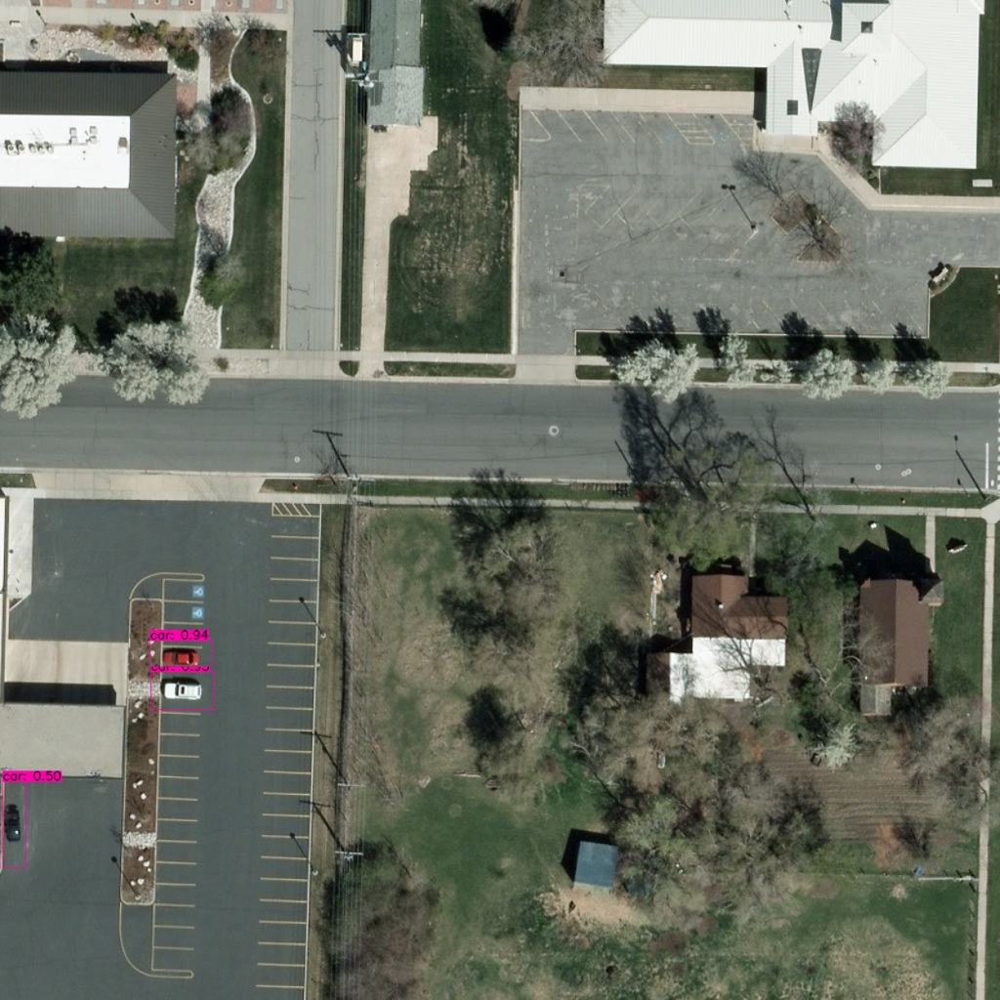

# Convert Darknet YOLOv4 or YOLOv3 to TensorFlow Model
[](LICENSE)

YOLOv4, YOLOv4-tiny Implemented in Tensorflow 2.3. 

This repository is created for the channel [TheCodingBug](https://www.youtube.com/channel/UCcNgapXcZkyW10FIOohZ1uA?sub_confirmation=1).

This repository shows how to convert YOLO v4, YOLOv3, YOLO tiny .weights to .pb, .tflite and trt format for tensorflow, tensorflow lite, tensorRT.


1. [Setting Up Environment](#setting-up-environment)
   * [Using Conda](#using-conda)
   * [Using Pip](#using-pip)
2. [Convert YOLOv4 to TensorFlow](#convert-yolov4-to-tensorflow)
   * [Run Object Detection](#run-object-detection)
3. [Convert YOLOv4 to tflite](#convert-to-tflite)
   * [Run Objection Detection using TFLite Model](#run-object_detection-using-tflite-model)
4. [FPS Comparison](#fps-comparison)


# Setting Up Environment
### Using Conda
#### CPU
```bash
# CPU
conda env create -f conda-cpu.yml


# activate environment on Windows or Linux
conda activate tf-cpu

# activate environment on Mac
source activate tf-cpu
```
#### GPU
```bash
# GPU
conda env create -f conda-gpu.yml

# activate environment on Windows or Linux
conda activate tf-gpu

# activate environment on Mac
source activate tf-gpu
```

### Using Pip
```bash
# CPU
pip install -r requirements.txt

# GPU
pip install -r requirements-gpu.txt

```
**Note:** If installing GPU version with Pip, you need to install CUDA and cuDNN in your system. You can find the tutorial for Windows [here](https://www.youtube.com/watch?v=PlW9zAg4cx8).
# Performance
<p align="center"></p>


# Convert YOLOv4 to TensorFlow

```bash
# Convert darknet weights to tensorflow
## yolov4
python save_model.py --weights ./data/path/to/weights/file --output ./checkpoints/save/folder/name --input_size 416 --model yolov4 

## yolov4-tiny
python save_model.py --weights ./data/path/to/tiny/weights/file --output ./checkpoints/save/folder/name --input_size 416 --model yolov4 --tiny

```
If you want to run yolov3 or yolov3-tiny change ``--model yolov3`` in command and also download corresponding YOLOv3 weights and and change ``--weights to ./data/yolov3.weights``

### Run Object Detection

```bash
# Run yolov4 on image
python detect-tiles.py

```

#### Output

##### Yolov4 original weight
<p align="center"></p>

# Convert to tflite

```bash
# Save tf model for tflite converting
python save_model.py --weights ./data/path/to/weights/file --output ./checkpoints/yolov4-416 --input_size 416 --model yolov4 --framework tflite

# yolov4
python convert_tflite.py --weights ./checkpoints/save/folder/name --output ./checkpoints/save/folder/name/*.tflite

# yolov4 quantize float16
python convert_tflite.py --weights ./checkpoints/save/folder/name --output ./checkpoints/save/folder/name/*.tflite --quantize_mode float16

# yolov4 quantize int8
python convert_tflite.py --weights ./checkpoints/save/folder/name --output ./checkpoints/save/folder/name/*.tflite --quantize_mode int8

```
### Run Objection Detection using TFLite Model

```bash
# Run demo tflite model
python detect-tiles-lite.py 
```
##### Yolov4 tflite fp16 weight
<p align="center"></p>


# References

  * YOLOv4: Optimal Speed and Accuracy of Object Detection [YOLOv4](https://arxiv.org/abs/2004.10934).
  * [darknet](https://github.com/AlexeyAB/darknet)
  
   My project is inspired by these previous fantastic YOLOv3 implementations:
  * [Yolov3 tensorflow](https://github.com/YunYang1994/tensorflow-yolov3)
  * [Yolov3 tf2](https://github.com/zzh8829/yolov3-tf2)
